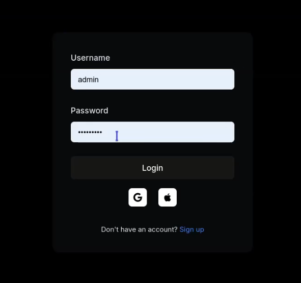
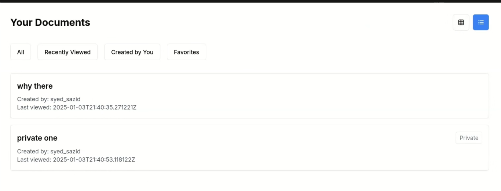
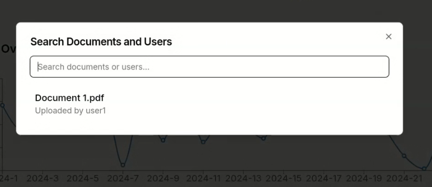
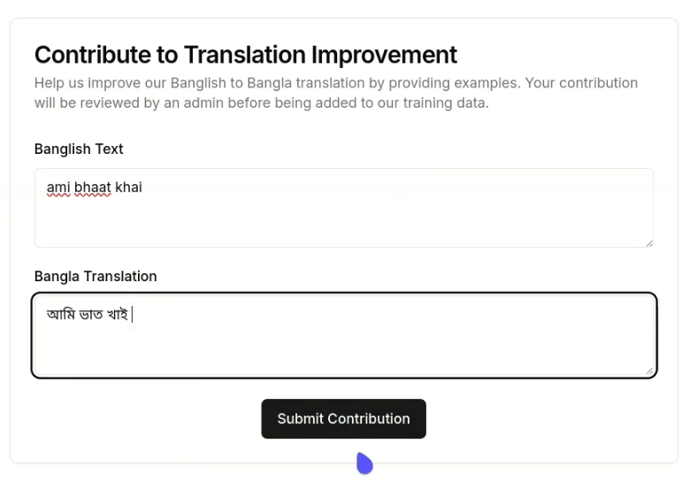
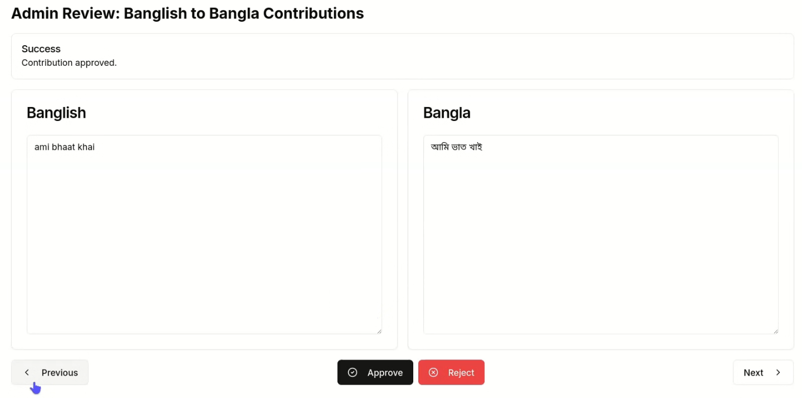
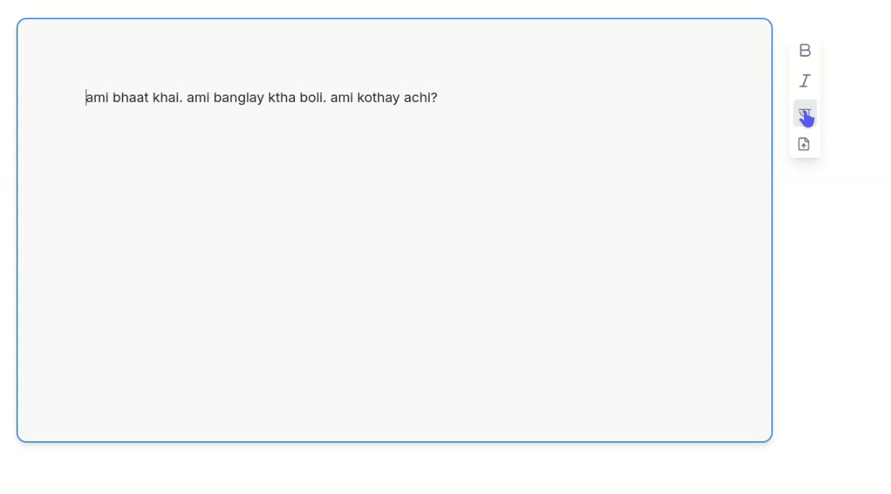
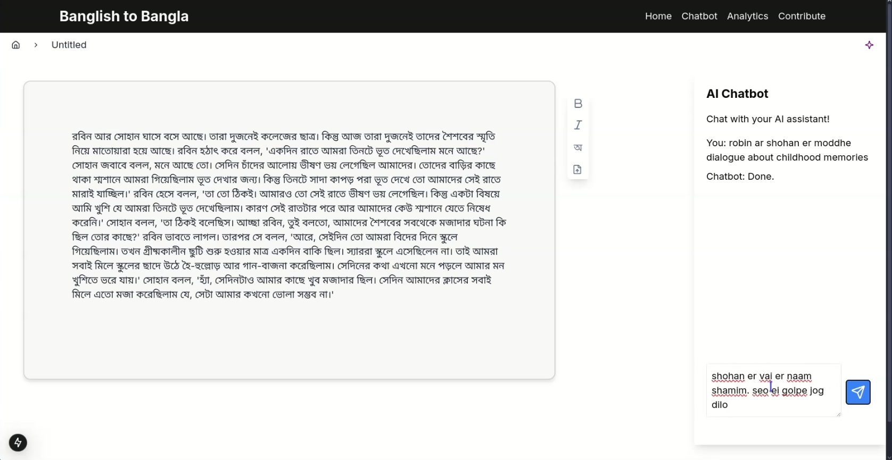

# 🌟 Banglish-to-Bangla Content Management Platform 🌟

🚀 **Hackathon Submission by Team SUST_Ackerman**

> Empowering users to seamlessly translate, manage, and share Bangla content with intuitive tools and AI-driven features.

---

## 🏆 **Project Overview**

This platform bridges the gap between Banglish and Bangla content creation, offering:

- 🔐 **Secure Authentication**
- 🌐 **Banglish-to-Bangla Translation**
- 📝 **Content Creation & Management**
- 🔍 **Advanced Search**
- 🤖 **AI-Powered Chatbot**
- 📈 **Continuous Translation Enhancement**

# 🎥 **Demo Video**: 

Watch our platform in action [here](https://youtu.be/0SrdHTziHzg).
[](https://youtu.be/0SrdHTziHzg)  


---

## 🔧 **Key Features**

### 1️⃣ Authentication

- 🛡️ Secure login and registration system.
- 🔒 Robust API security ensures authorized access.

### 2️⃣ Banglish-to-Bangla Conversion

- 🌐 High-accuracy translation system for seamless content transformation.

### 3️⃣ Content Management

- ✍️ Intuitive text editor for Banglish content creation and Bangla conversion.
- 📄 Export content as public or private PDFs.
- 🤖 AI-generated titles and captions for PDFs.

### 4️⃣ Search Functionality

- 🔍 Comprehensive app-wide search for user profiles and PDFs in Bangla and Banglish.

### 5️⃣ Chatbot Integration

- 🤖 Banglish-understanding chatbot with Bangla responses.
- 📂 Intelligent PDF-based query resolution for smarter answers.

### 6️⃣ Translation System Improvement

- 🧠 User-contributed data enhances translation quality, verified by admins.

---

## 🛠️ **Tech Stack**

| **Component**        | **Technology**            |
| -------------------------- | ------------------------------- |
| **Frontend**         | React.js, Tailwind CSS          |
| **Backend**          | Django                          |
| **Database**         | MySQL                           |
| **AI/ML**            | PyTorch, Gemini API             |
| **Environment Mgmt** | `.env` file for configuration |

---

## 🎨 **UI/UX Design Goals**

- 🧑‍💻 **User-Friendly Interface**: Simple and intuitive for all users.
- 🌟 **Minimalistic Design**: Seamless navigation and functionality.

---

## 🚀 **Getting Started**

### Prerequisites

Ensure the following are installed:

- [Django](https://www.djangoproject.com/)
- [Node.js](https://nodejs.org/)

### Installation

#### 1️⃣ Backend Setup (Django):

```bash
git clone https://github.com/SUST-Ackerman/Bitfest_Hackathon_2025_Final_Round.git  
cd backend  
python3 -m venv venv  
source venv/bin/activate  
pip install -r requirements.txt  
cp .env.example .env  
python manage.py migrate  
python manage.py runserver 0.0.0.0:8000  
```

#### 2️⃣ Frontend Setup (React.js):

```bash
cd frontend  
npm install  
cp .env.local.example .env.local  
npm run dev  
```

---

## 🏗️ **Project Status**

### ✅ **Implemented Features**

- **Authentication**: Secure login (NextAuth + Django Rest Framework).
- **Content Management**: Efficient text editing and PDF exporting.
- **Search Functionality**: Advanced search for profiles and PDFs.
- **Chatbot Integration**: Conversational AI for Banglish/Bangla.
- **Dataset Training**: AI improvement through user feedback.
- **Admin Review System**: Ensures data accuracy.
- **Banglish-to-Bangla Conversion**: Powered by Gemini API.
- **AI Document Manipulation**: Smart PDF handling via Gemini.
- **Scalable Backend**: Optimized with Django.

### 🚧 **Features in Progress**

- Enhanced chatbot capabilities.
- Advanced translation optimization.

---
